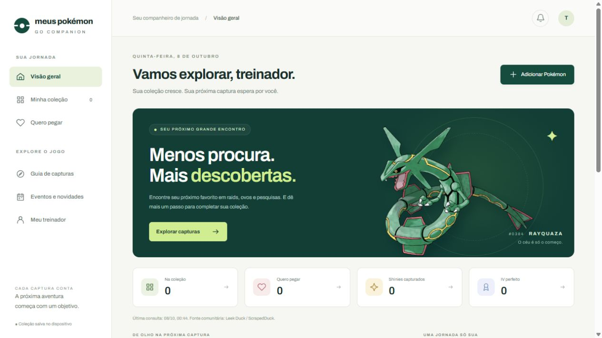

<div align="center">
  
  <h1>Meus Pokémon GO</h1>
  <p><strong>Sua coleção, suas próximas capturas e os eventos do Brasil em um só lugar.</strong></p>
  <p>
    
    
    
    
  </p>
  <p>
    <a href="https://meuspokemongo.vercel.app">
      
    </a>
  </p>
  <p>
    <a href="https://meuspokemongo.vercel.app/#collection">Minha coleção</a> ·
    <a href="https://meuspokemongo.vercel.app/#events">Calendário</a> ·
    <a href="https://github.com/hugotakeda/Meus-Pokemon-GO/issues">Relatar um problema</a>
  </p>
</div>

---

## 📋 Sobre

O **Meus Pokémon GO** é um companheiro de jornada para organizar capturas, planejar objetivos e acompanhar a programação do jogo disponível no Brasil. A interface reúne coleção, lista de desejos, guia de encontros, calendário e perfil de treinador, com uma identidade visual em verde e tons claros adaptada a desktop e celular.

Desenvolvido com **HTML, CSS e JavaScript puro**, o projeto funciona como um site estático. Os dados pessoais ficam no navegador; os encontros e eventos são consultados em fontes comunitárias públicas. Não é necessário criar uma conta, e o site não se conecta à sua conta do Pokémon GO.

Cada exemplar tem seu próprio registro: dois Golem podem ter formas, CP, IVs e anotações diferentes. A coleção reconhece as **18 formas de Alola**, com imagens comuns e shiny, atributos próprios e distinção no radar de desejos.

---

## ✨ Funcionalidades principais

### 🎒 Coleção e lista de desejos

> Registre cada captura e dê um destino ao próximo Pokémon que você quer encontrar.

- Adição pelo nome em inglês, pelas sugestões ou pelo número da Pokédex, de **1 a 1025**.
- Listas **Tenho** e **Quero pegar**; a ação **Peguei!** leva o desejo para a coleção.
- CP, IVs de ataque/defesa/PS, notas individuais e tags **100%, Shiny, Sombroso, Purificado, Sortudo e Mega**.
- Edição e evolução preservando as informações do exemplar; remoção com opção de desfazer.
- Busca por nome, número ou Alola, filtros por tag e ordenação por adição, CP, IV, nome ou Pokédex.

### 🌴 Formas de Alola e nível estimado

> A forma regional faz parte do cadastro, sem misturar as informações de exemplares da mesma espécie.

| Recurso | Como funciona |
| --- | --- |
| Seleção de forma | O campo **Forma** aparece para as espécies que possuem versão de Alola. |
| Nomes alternativos | Aceita `golem-alola`, `Alolan Golem`, `Golem de Alola` e outras variações. |
| Imagens | Usa a arte da forma selecionada, incluindo shiny. Se a arte shiny falhar, tenta a imagem comum da mesma forma. |
| Evoluções | Sugere a cadeia regional e preserva Alola quando a evolução também possui essa forma. |
| Nível | Estima o nível a partir da espécie, forma, CP e dos três IVs. |

**Já cadastrou um Golem como normal?** Abra **Editar → Forma → De Alola → Salvar**. CP, IVs, tags e anotações são mantidos. Registros antigos sem indicação de forma precisam desse ajuste manual.

<details>
<summary><strong>Ver as 18 espécies com forma de Alola</strong></summary>

Rattata, Raticate, Raichu, Sandshrew, Sandslash, Vulpix, Ninetales, Diglett, Dugtrio, Meowth, Persian, Geodude, Graveler, Golem, Grimer, Muk, Exeggutor e Marowak.

</details>

O cálculo percorre níveis **1 a 51**, em passos de meio nível:

| Resultado | Significado |
| --- | --- |
| `37` | Os valores informados correspondem ao nível 37 na conta. |
| `~37` | O nível 37 é uma aproximação: o CP ficou próximo, mas não correspondeu exatamente. |
| Uma faixa de níveis | Mais de um nível produz o mesmo CP. |
| `Não confere` | No formulário, os valores não correspondem a um resultado aceito pelo cálculo. |

Os multiplicadores e atributos GO da coleção ficam em `collection.js`; os atributos próprios de Alola ficam em `pokemon-forms.js`. Espécies ausentes da tabela podem recorrer a uma conversão aproximada da PokéAPI. **O nível de Mega não é calculado.**

### 🔎 Guia de capturas e radar de desejos

> Consulte os encontros informados pelas fontes e descubra quais deles estão na sua lista.

| Área | Informações disponíveis |
| --- | --- |
| Raids | Chefes, categoria, tipos e intervalos de CP de captura, quando informados. |
| Ovos | Espécies por distância, origem, disponibilidade regional e raridade publicada. |
| Pesquisas | Tarefas de campo e possíveis recompensas. |
| Equipe Rocket | Formações de líderes e recrutas, com indicação de encontros resgatáveis. |
| Shinies | Encontros marcados pela fonte como elegíveis a shiny, reunidos por origem. |

O radar cruza seus desejos com esses encontros, distinguindo **forma normal e Alola**, além das condições shiny, sombroso e Mega. O botão **Quero pegar** adiciona um objetivo diretamente pelo guia.

A calculadora de chance shiny usa a taxa que você informar. A disponibilidade de um shiny na fonte **não confirma uma taxa aumentada**; o radar também não confirma IV perfeito, condição sortuda ou purificação.

### 📅 Calendário de eventos no Brasil

> Veja Pokémon, períodos e bônus do mês em uma programação organizada.

- **Resumo do mês:** cartões visuais para raids, Mega, Hora de Reides, Hora do Holofote, eventos Max e outras categorias presentes na fonte.
- **Grade mensal:** eventos distribuídos pelos dias, com navegação entre meses e botão **Hoje**.
- Busca por Pokémon ou evento, filtros por tipo e opção de exibir apenas os eventos salvos.
- Detalhes com fonte, abrangência, horários e bônus confirmados; dados não informados permanecem sinalizados.
- Bônus semanais e encontros da descoberta extraordinária quando há um suplemento editorial válido para a temporada.

**A agenda mostra eventos globais disponíveis no Brasil e eventos brasileiros verificados.** Edições presenciais estrangeiras e eventos sem confirmação de disponibilidade ficam ocultos. Essa seleção usa regras editoriais, sem depender de geolocalização.

Os horários seguem o **fuso do dispositivo**. O feed não é um arquivo histórico completo: meses passados podem ter eventos ausentes e meses futuros podem estar parcialmente anunciados.

### 🔔 Lembretes e perfil do treinador

> Prepare sua agenda e tenha seu código de amizade sempre à mão.

- Perfil com nome, equipe e código de amizade de 12 dígitos.
- QR gerado localmente, com opções de copiar o código e baixar o QR em SVG.
- Eventos salvos e exportação individual ou em conjunto para calendário no formato **`.ics`**.
- Notificações próximas do início do evento, mediante permissão e suporte do navegador.
- Avisos dentro da página quando uma nova consulta identifica mudanças nas rotações.

**As notificações exigem a página aberta.** Para lembretes com o site fechado, importe o `.ics` no seu aplicativo de calendário e configure os avisos nele. A exportação é uma cópia: mudanças posteriores no evento exigem nova exportação. O perfil e o QR não autenticam sua conta nem criam amizades automaticamente.

### 💾 Backup e dados locais

> Sua coleção permanece no dispositivo, com exportação para levar os registros com você.

**Exportar backup** gera um JSON com coleção, desejos, perfil e lembretes. **Importar backup** valida o arquivo e pede confirmação antes de substituir dados existentes. Backups antigos continuam aceitos; identificadores repetidos são corrigidos sem juntar os exemplares.

Use o mesmo **navegador e endereço** para reencontrar seus registros. Não há sincronização entre dispositivos. Antes de trocar de domínio, navegador ou aparelho, exporte um backup. Se a coleção salva estiver corrompida, novas inclusões ficam bloqueadas e os dados originais podem ser exportados para recuperação.

---

## 📸 Demonstração



*Tela inicial em um navegador sem registros pessoais. Os indicadores refletem a coleção de cada treinador.*

**[Explorar o site](https://meuspokemongo.vercel.app)** · **[Abrir o calendário](https://meuspokemongo.vercel.app/#events)**

---

## 🏗️ Arquitetura

A aplicação roda inteiramente no navegador. `app.js` integra as telas, a coleção mantém os registros locais e os módulos de dados consultam os feeds externos com cache independente. O calendário aplica as regras de disponibilidade no Brasil antes de exibir os eventos.

```text
Meus-Pokemon-GO/
├── index.html               # Estrutura, navegação e formulários
├── app.js                   # Integração das telas, guias e radar
├── collection.js            # Exemplares, backups, evoluções e nível
├── pokemon-forms.js         # Formas de Alola, sprites e atributos GO
├── companion-data.js        # Consulta, normalização e cache dos feeds
├── companion-rules.js       # Desejos e identificação de mudanças
├── brazil-event-scope.js     # Eventos válidos no Brasil e exceções
├── calendar-rules.js         # Datas, categorias e recortes mensais
├── event-calendar.js         # Resumo visual, grade e detalhes
├── trainer.js               # Perfil, QR, lembretes e arquivos .ics
├── styles.css               # Identidade visual e layout responsivo
├── legacy.css               # Estilos da coleção e dos diálogos
├── event-calendar.css       # Estilos do calendário
├── trainer.css              # Estilos do perfil e dos lembretes
├── assets/readme/           # Marca e demonstração da documentação
├── vendor/                  # Gerador de QR e sua licença
└── tests/                   # Testes com o executor nativo do Node.js
```

<details>
<summary><strong>Armazenamento e formato do backup</strong></summary>

| Chave no `localStorage` | Conteúdo |
| --- | --- |
| `pgo` | Coleção e desejos, nas listas `have` e `want`. |
| `pgo-dex`, `pgo-evo`, `pgo-stats` | Nomes, evoluções e atributos consultados. |
| `pgo-companion-feed-v1` | Cache dos cinco feeds e horários de consulta. |
| `pgo-profile` | Perfil e código do treinador. |
| `pgo-reminders` | Lembretes salvos. |
| `pgo-notifications`, `pgo-watch` | Preferências de avisos. |

Os exemplares mantêm `uid`, `id` da Pokédex, `name`, `form`, `cp`, `note`, `iv`, tags booleanas e, quando presente, `evolvedFrom`. O campo `form` distingue `normal` e `alola`; nomes e IDs de variedade reconhecidos são normalizados na leitura de backups antigos.

O arquivo exportado usa `version: 2`, com `have`, `want` e o bloco `companion` para perfil e lembretes. A chave local `pgo` continua guardando apenas a coleção. Limpar os dados do navegador remove os registros dessa origem.

</details>

---

## 💻 Rodando localmente

### Pré-requisitos

- Um navegador atualizado.
- Git para clonar o repositório, ou a opção **Download ZIP** do GitHub.
- Um servidor de arquivos estáticos; o exemplo abaixo usa **Python 3**.
- **Node.js** para executar os testes.

### Instalação e execução

```bash
# Clone o repositório e entre na pasta
git clone https://github.com/hugotakeda/Meus-Pokemon-GO.git
cd Meus-Pokemon-GO

# Inicie o servidor local
python -m http.server 8000 --bind 127.0.0.1
```

Abra **[http://127.0.0.1:8000](http://127.0.0.1:8000)**. Em ambientes que usam `python3`, substitua `python` no comando. A aplicação não exige `npm install`, variáveis de ambiente ou uma etapa de build.

Mantenha a pasta completa: o `index.html` depende dos arquivos JavaScript, CSS e de `vendor/`. Abrir o HTML diretamente pode limitar recursos do navegador; para notificações, use localhost no desenvolvimento e HTTPS na publicação.

### Qualidade e testes

```bash
node --test tests/*.test.cjs
```

A suíte usa fixtures locais e não depende de rede. Ela cobre coleção, notas individuais, formas de Alola, CP/IVs, backups, fontes de dados, radar, eventos no Brasil, calendário e lembretes. Ao alterar a interface, confira também desktop e celular.

### Publicação

Publique a pasta completa em uma hospedagem estática. Na **Vercel**, o projeto usa o preset **Other**, sem comando de build e com a raiz do projeto como diretório de saída. O mesmo conjunto de arquivos pode ser servido pelo Netlify ou GitHub Pages.

Preserve o domínio do site para manter o acesso aos dados já salvos nessa origem. Uma prévia de deploy tem seu próprio armazenamento e não recebe automaticamente a coleção do endereço principal.

---

## 🛠️ Tecnologias principais

| Tecnologia | Função no projeto |
| --- | --- |
| **HTML5 e CSS3** | Estrutura, diálogos e layout responsivo. |
| **JavaScript puro** | Regras da coleção, navegação e integração da interface. |
| **Web APIs** | `localStorage`, Fetch, notificações e downloads locais. |
| **PokéAPI e PokeAPI/sprites** | Nomes, evoluções e arte dos Pokémon. |
| **Leek Duck via ScrapedDuck** | Eventos, raids, ovos, pesquisas e Equipe Rocket. |
| **PokeMiners e PoGoAPI** | Fontes das tabelas locais de atributos e multiplicadores GO. |
| **Gerador de QR local** | Código de amizade convertido em QR no navegador. |
| **Node.js (`node:test`)** | Execução dos testes automatizados. |
| **Vercel** | Hospedagem estática do site. |

---

## 🔧 Atualização das fontes

Os cinco feeds têm cache de **15 minutos**, timeout de **12 segundos** e atualização manual em **Atualizar dados**. Quando uma fonte falha, as outras continuam disponíveis; uma cópia anterior pode ser exibida, com aviso, por até **7 dias**. “Última consulta” indica quando o site baixou os dados, não quando a fonte revisou o conteúdo.

Algumas informações exigem manutenção no código:

| Arquivo | O que precisa ser conferido |
| --- | --- |
| `brazil-event-scope.js` | Abrangência brasileira de eventos genéricos e exceções vinculadas a ID, tipo e datas. |
| `companion-data.js` | Bônus semanais e encontros da descoberta extraordinária, vinculados à temporada e ao período revisado. |
| `collection.js` e `pokemon-forms.js` | Tabelas locais de atributos e multiplicadores, com suas fontes. |

**Atualizar dados não revisa essas regras editoriais.** Novos eventos sem classificação podem permanecer ocultos até a conferência e publicação de uma atualização. Os atributos de Alola foram conferidos em **07/10/2026**; a data está registrada no catálogo.

---

## 🤝 Contribuindo

Encontrou um problema? [Abra uma issue](https://github.com/hugotakeda/Meus-Pokemon-GO/issues) com o comportamento esperado, os passos para reproduzir e o navegador utilizado. Para correções de eventos, inclua a fonte que confirma as datas e a disponibilidade no Brasil.

Ao propor uma mudança, execute os testes, confira as telas afetadas e preserve a compatibilidade dos backups. Capturas de tela podem ajudar na revisão, sem expor seu código de treinador ou outras informações pessoais.

---

## 🙏 Fontes e créditos

- **[Leek Duck](https://leekduck.com/) e [ScrapedDuck](https://github.com/bigfoott/ScrapedDuck):** encontros e agenda. Os [termos de uso do ScrapedDuck](https://github.com/bigfoott/ScrapedDuck#for-developers) exigem créditos, proíbem colocar a API atrás de um paywall e proíbem monetização do aplicativo com anúncios.
- **[PokéAPI](https://pokeapi.co/) e [PokeAPI/sprites](https://github.com/PokeAPI/sprites):** nomes, evoluções e imagens.
- **[PokeMiners/game_masters](https://github.com/PokeMiners/game_masters) e [PoGoAPI](https://pogoapi.net/api/v1/pokemon_stats.json):** dados usados nas tabelas de cálculo.
- **Kazuhiko Arase:** biblioteca de QR incluída localmente, com a licença preservada em [vendor/qrcode.LICENSE](vendor/qrcode.LICENSE).

As informações do guia são comunitárias e podem mudar. Outras formas regionais, como Galar, Hisui e Paldea, ainda não têm cadastro e atributos próprios. O projeto não possui uma licença geral declarada; as licenças e condições das dependências e fontes continuam aplicáveis.

Projeto de fã desenvolvido por **[Hugo Takeda](https://github.com/hugotakeda)**, sem vínculo com GO Companion, Niantic, Nintendo, Game Freak ou The Pokémon Company. Pokémon e Pokémon GO são marcas de seus respectivos donos.
